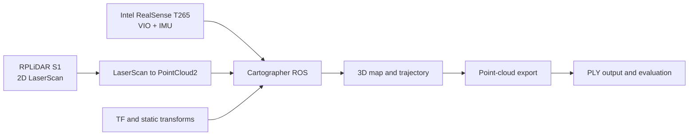

## Repository Note

This repository is a cleaned public portfolio version of my PhD research codebase. It contains selected code structure, configuration examples, documentation and representative processing scripts for a visual-inertial and LiDAR SLAM system used for GPS-denied indoor 3D mapping.

Sensitive data, raw ROS bag files, facility-specific information and unpublished research materials have been removed.# Visual-Inertial LiDAR SLAM for Indoor 3D Reconstruction

This repository documents a ROS-based spatial perception pipeline developed during my PhD research at the University of Bristol. The system combines a vertically mounted 2D LiDAR, Intel RealSense T265 visual-inertial tracking and Cartographer-based pose-graph optimisation to generate 3D maps in GPS-denied indoor environments.

The purpose of this public version is to show the research-engineering structure of the project while avoiding sensitive data and site-specific files.

## Project summary

**Problem:** Indoor inspection platforms often operate without GNSS, with strict payload, power and compute constraints. Conventional 3D LiDAR can be too heavy for small aerial systems.

**Approach:** Use a vertically mounted lightweight 2D LiDAR and the motion of the platform to accumulate 3D structure over time. Fuse this with visual-inertial odometry from a RealSense T265 and optimise the trajectory using Cartographer.

**Key technologies:** ROS 1, Cartographer, RPLiDAR S1, Intel RealSense T265, Raspberry Pi 4, PointCloud2, TF frames, Python, C++, Linux.

## System architecture



## Repository structure

```text
config/       Cartographer and point-cloud export configuration templates
launch/       ROS launch template showing key topic remaps
scripts/      Utility scripts for topic checking, map evaluation and point-cloud handling
docs/         System notes, result templates and data-safety notes
media/        Add public-safe screenshots, diagrams or result images here
```

## What this project demonstrates

- 3D reconstruction from 2D LiDAR motion and visual-inertial pose tracking
- Practical sensor fusion under real hardware constraints
- ROS topic management, TF frames and Cartographer configuration
- Data collection, calibration, benchmarking and failure analysis
- Real-world robotics deployment beyond ideal laboratory datasets

## Example workflow

```bash
# 1. Check ROS topics
python3 scripts/check_ros_topics.py

# 2. Launch mapping pipeline
roslaunch launch/mapping.launch

# 3. Export high-detail point cloud using Cartographer assets writer
# Replace paths with your local bag and pose graph files.
cartographer_assets_writer \
  -configuration_directory config \
  -configuration_basename pointcloud_export.lua \
  -urdf_filename urdf/blimp_sensor_stack.urdf \
  -bag_filenames <your_bag_file>.bag \
  -pose_graph_filename <your_pose_graph_file>.pbstream

# 4. Evaluate map dimensions against reference measurements
python3 scripts/evaluate_reconstruction_error.py --reference docs/example_reference_measurements.csv --observed docs/example_observed_measurements.csv
```

## Results to add

Representative public-safe outputs to include:
- Warehouse point-cloud screenshot
- Top-down trajectory overlay
- TF tree diagram
- Sensor stack photo
- Reconstruction-error table

## Data and safety notice

This public repository does not include raw site data, private rosbag files, internal facility layouts or sensitive nuclear-environment details. It is intended as a portfolio-safe technical summary and reproducible code skeleton.

## Future work

- Add public demo data from a non-sensitive indoor environment
- Add a COLMAP comparison pipeline for camera-only reconstruction
- Add a small 3D Gaussian Splatting demo using public or self-captured imagery
- Port launch files and nodes to ROS 2
